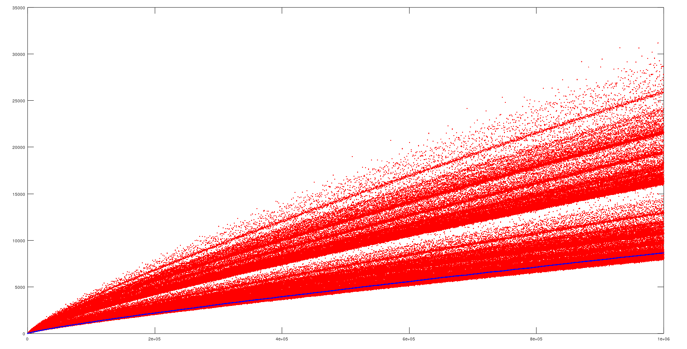

# 一种估算哥德巴赫猜想的拆分方法个数的方法

## 哥德巴赫猜想

哥德巴赫猜想说，每一个足够大的偶数（大于6），都能表示为两个素数之和。

这篇文章给出一种方法，来估算“把偶数拆成两个素数之和的拆法”。

如“10”可以拆为3+7、5+5、7+3共三种拆分方法。（不同的加法顺序，本文把它视作不同的拆分方法）

## 筛法求素数

素数是指没有非平凡因数的自然数。如2、3、5、7、11等。

一种简单的判断素数的方法，是试除法。对于一个数n>1，如果想要判断它是不是素数，可以依次用2、3、4、5等数来尝试整除n——如果无法找到非平凡因子，则说明n是素数。

埃拉托斯特尼筛法是一种快速求出$1 \sim n$的所有素数的有效方法。

它的思路如下，

首先将$1 \sim n$这n个数全部列出来；因为1不是素数，划掉1。

接着，划掉所有2的倍数（但不包括2本身）

再接着，划掉所有3的倍数（但不包括3本身）

……

只要划掉了$2 \sim \sqrt{n}$之间所有数的倍数，剩下的就全都是素数了。

## 筛法求偶数拆成素数的方法

将上述方法稍微改变，就可以得到求偶数$n$拆成素数之和的所有方法。

首先列出$1 \sim n$这n个数；划掉$1$、$n-1$和$n$这三个数。

划掉所有的偶数（2的倍数，包括2本身）。

划掉所有的3的倍数（不包括3本身）；每划掉一个数$x$，也同时划掉$n-x$。

划掉所有的5的倍数（不包括5本身）；每划掉一个数$x$，也同时划掉$n-x$。

……

只要上述的过程重复，一直到$\sqrt n$，剩下每一个数$x$自然就满足“$x$是素数”且“$n-x$是素数”这个条件；也只有不满足条件的数才会被划掉。


##### 以14举例

首先列出所有数

$1\ \ 2\ \ 3\ \ 4\ \ 5\ \ 6\ \ 7\ \ 8\ \ 9\ \ 10\ \ 11\ \ 12\ \ 13\ \ 14$

划掉1、13、14

$\cancel{1}\ \ 2\ \ 3\ \ 4\ \ 5\ \ 6\ \ 7\ \ 8\ \ 9\ \ 10\ \ 11\ \ 12\ \ \cancel{13}\ \ \cancel{14}$

划掉所有的偶数

$\cancel{1}\ \ \cancel{2}\ \ 3\ \ \cancel{4}\ \ 5\ \ \cancel{6}\ \ 7\ \ \cancel{8}\ \ 9\ \ \cancel{10}\ \ 11\ \ \cancel{12}\ \ \cancel{13}\ \ \cancel{14}$

划掉所有的3的倍数（不包括3本身）；每划掉一个数$x$，也同时划掉$n-x$。

$\cancel{1}\ \ \cancel{2}\ \ 3\ \ \cancel{4}\ \ \cancel{5}\ \ \cancel{6}\ \ 7\ \ \cancel{8}\ \ \cancel{9}\ \ \cancel{10}\ \ 11\ \ \cancel{12}\ \ \cancel{13}\ \ \cancel{14}$

3接下来的素数是5，因为$5^2>14$，已经可以结束上述重复过程。

剩下的数是$3$、$7$、$11$。

因此我们知道14可以用三种方式拆分成素数之和：3+11、7+7、11+3。


# 估算解的个数

上述过程具有较强的规律性，对于较大的n可以估算出每次“划掉”的数的数量。

划掉$1$、$n-1$和$n$：固定为划掉3个数。

在剩下的数里划掉偶数：数量大约减半。

划掉3的倍数（不包括3本身）（以及附带划掉$n-x$）：如果n是3的倍数，则大约划掉剩下数的$\frac{1}{3}$；如果n不是3的倍数，则大约划掉剩下数的$\frac{2}{3}$。

划掉5的倍数（不包括5本身）（以及附带划掉$n-x$）：如果n是5的倍数，则大约划掉剩下数的$\frac{1}{5}$；如果n不是3的倍数，则大约划掉剩下数的$\frac{2}{5}$。

……

以上过程，一直重复到$\sqrt{n}$

用C语言可以表示为

```C
#include <stdio.h>
#include <math.h>
#include <stdbool.h>

bool is_prime(int x)
{
    if (x <= 1)
        return 0;
    for (int i = 2; i <= sqrt(x); i++)
    {
        if (x % i == 0)
        {
            return 0;
        }
    }
    return 1;
}

double appro(int n)
{
    double v = n * 0.5;
    for (int i = 3; i <= sqrt(n); i++)
    {
        if (is_prime(i))
        {
            if (n % i == 0)
            {
                v *= 1.0 - 1.0 / i;
            }
            else
            {
                v *= 1.0 - 2.0 / i;
            }
        }
    }
    return v;
}

int main()
{
    double v = appro(1000000);
    printf("%f\n", v);
}

```

上述程序估算1000000可以用多少种方式拆分成素数之和。
运行结果是“11541.753904”。

1000000实际上可以用10804种方式拆分成素数之和。估算的相对误差为6.83%，可以看到这种方法估算的是比较准确的。

换一个例子，用上述方法估算12345678的拆分方法数量为“157224.992970”，而实际值是142338，相对误差为10.46%，也比较准确。


从上述估算过程可以看到，如果数$n$有较小的素因子（除了2），则它就会有比较多的拆分方法；反之则拆分方法会比较少。

将上述程序稍加修改，可以用来估算某个数量级的$n$的解数量的下限（即，假设$n$没有小的素因子）。

如下图，这个下限拟合得较好（蓝线为估算值，红点为实际值）。


